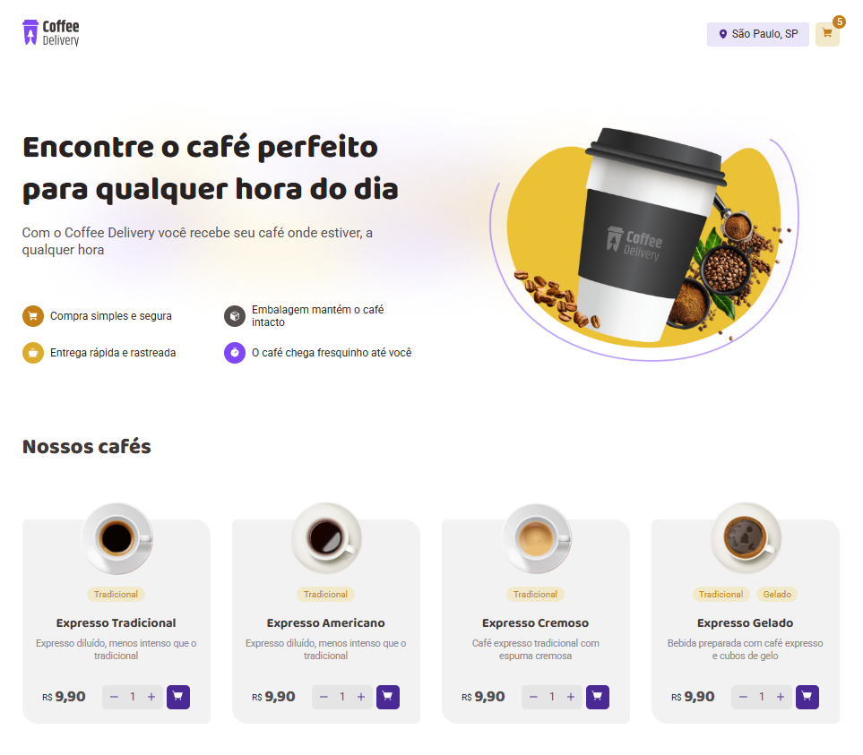

# ☕ Coffee Delivery

Projeto desenvolvido como desafio da trilha de React do Ignite da Rocketseat. O objetivo é criar uma aplicação de e-commerce fictícia para venda de cafés especiais, com funcionalidades como seleção de produtos, carrinho de compras e formulário de entrega.

## 📸 Capturas de tela

 <!-- Altere ou adicione uma imagem do jogo se desejar -->

---

## 🔥 Tecnologias Utilizadas

- [ReactJS](https://reactjs.org/)
- [TypeScript](https://www.typescriptlang.org/)
- [Vite](https://vitejs.dev/)
- [React Router DOM](https://reactrouter.com/)
- [Context API](https://reactjs.org/docs/context.html)
- [React Hook Form](https://react-hook-form.com/)
- [Styled Components](https://styled-components.com/)
- [Phosphor Icons](https://phosphoricons.com/)
- [Zod](https://zod.dev/)

## 🔗 Acesse o Projeto Online

[Clique aqui para acessar o Coffee Delivery](https://coffee-delivery-rho-two.vercel.app/)

## ⚙️ Funcionalidades

- Listagem de cafés disponíveis para compra
- Adicionar e remover produtos do carrinho
- Atualização dinâmica da quantidade e preço total
- Formulário de entrega com validação
- Escolha do método de pagamento
- Checkout final simulando pedido confirmado

## 🚀 Como executar o projeto

### Pré-requisitos

- Node.js instalado
- Gerenciador de pacotes (npm ou yarn)

### Passos para rodar localmente

```bash
# Clone o repositório
git clone https://github.com/marcelobueno25/coffee.delivery.git

# Acesse a pasta do projeto
cd coffee.delivery

# Instale as dependências
npm install
# ou
yarn install

# Inicie o servidor de desenvolvimento
npm run dev
# ou
yarn dev
